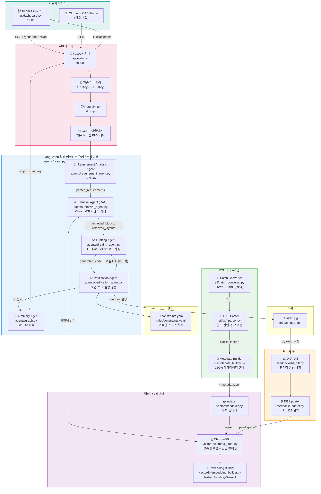
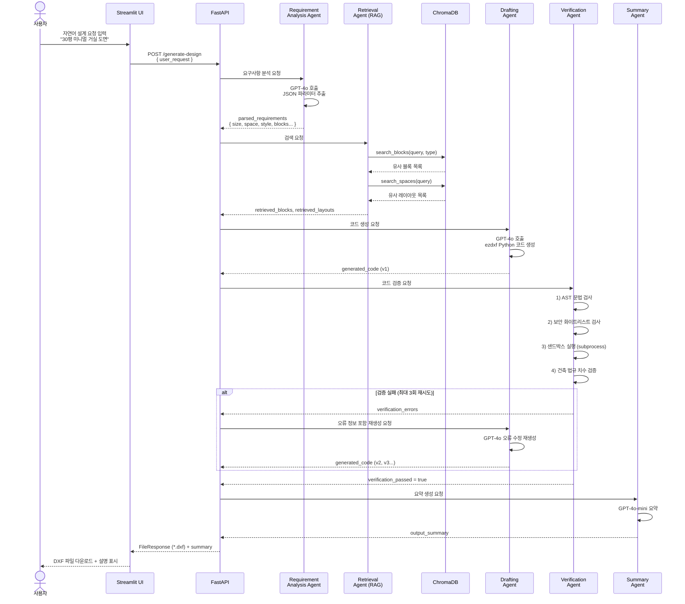

# ApartAgent 개발 진행 현황 보고서

> **프로젝트명**: ApartAgent — 아파트 인테리어 설계 자동화 멀티 에이전트 시스템  
> **보고서 작성일**: 2026-05-19  
> **기준 브랜치**: `main`

---

## 목차

1. [전체 개발 진행도 요약](#1-전체-개발-진행도-요약)
2. [시스템 아키텍처 구성도](#2-시스템-아키텍처-구성도)
3. [데이터 흐름도](#3-데이터-흐름도)
4. [Phase별 구현 상태 상세](#4-phase별-구현-상태-상세)
5. [모듈별 구현 완료 체크리스트](#5-모듈별-구현-완료-체크리스트)
6. [기술 스택 현황](#6-기술-스택-현황)
7. [보안 구현 현황](#7-보안-구현-현황)
8. [미구현 항목 및 추후 과제](#8-미구현-항목-및-추후-과제)

---

## 1. 전체 개발 진행도 요약

| Phase | 설명 | 상태 | 완성도 |
|---|---|---|---|
| Phase 1 | CAD 데이터 파싱 및 구조화 (ETL) | ✅ 완료 | 100% |
| Phase 2 | 벡터 DB 구축 및 임베딩 파이프라인 | ✅ 완료 | 100% |
| Phase 3 | 멀티 에이전트 아키텍처 (LangGraph) | ✅ 완료 | 100% |
| Phase 4 | REST API 및 UI 대시보드 | ✅ 완료 | 100% |
| Phase 5 | 피드백 루프 및 지속적 학습 | ✅ 완료 | 100% |
| 인프라 | Docker 컨테이너화 및 배포 구성 | ✅ 완료 | 100% |
| 보안 | OWASP Top 10 대응 및 보안 감사 | ✅ 완료 | 100% |
| 테스트 | 단위 테스트 작성 | ✅ 완료 | 90% |
| **시드 데이터** | **실제 DXF 도면 데이터 준비** | ⏳ 미완료 | 0% |
| **CI/CD** | **자동화 배포 파이프라인** | ⏳ 미완료 | 0% |

> **전체 코어 로직 구현률: 약 95%**  
> 시드 데이터(실제 DXF 파일)와 CI/CD 파이프라인을 제외한 모든 핵심 기능이 구현 완료된 상태입니다.

---

## 2. 시스템 아키텍처 구성도



---

## 3. 데이터 흐름도



---

## 4. Phase별 구현 상태 상세

### Phase 1 — CAD 데이터 파싱 및 구조화 (ETL) ✅

| 파일 | 역할 | 상태 |
|---|---|---|
| `etl/batch_converter.py` | DWG → DXF 일괄 변환 (ODA File Converter CLI 활용) | ✅ 완료 |
| `etl/dxf_parser.py` | DXF 블록 정의 및 INSERT 엔티티 추출, 블록 타입 자동 분류 | ✅ 완료 |
| `etl/metadata_builder.py` | 파싱 결과를 `*_metadata.json` 파일로 저장, 배치 처리 지원 | ✅ 완료 |

**주요 구현 내용:**
- **AIA CAD Layer 컨벤션** 기반 레이어별 공간 분류 (`A-ROOM-BR`, `A-ROOM-LR` 등)
- 블록 이름 키워드 매핑 20종 (`DOOR`, `WIN`, `SINK`, `BED`, `TOILET` 등)
- `ezdxf.bbox.extents()` 를 이용한 블록 바운딩 박스 치수 자동 추출

---

### Phase 2 — 벡터 DB 구축 및 임베딩 전략 ✅

| 파일 | 역할 | 상태 |
|---|---|---|
| `vectordb/embedding_builder.py` | 블록·공간 메타데이터 → 임베딩용 자연어 텍스트 직렬화 | ✅ 완료 |
| `vectordb/chroma_store.py` | ChromaDB CRUD, 하이브리드 검색 (시맨틱 + 메타데이터 필터) | ✅ 완료 |
| `vectordb/indexer.py` | `data/metadata/*.json` 일괄 인덱싱 CLI 스크립트 | ✅ 완료 |

**주요 구현 내용:**
- 2개 컬렉션 분리: `cad_blocks` (개별 가구/설비 블록), `cad_spaces` (공간 레이아웃)
- 임베딩 모델: `text-embedding-3-small` (OpenAI)
- 유사도 계산: **코사인 유사도** (`hnsw:space: cosine`)
- 하이브리드 검색: 시맨틱 벡터 검색 + 블록 타입/치수 메타데이터 필터 결합

---

### Phase 3 — 멀티 에이전트 아키텍처 (LangGraph) ✅

| 파일 | 역할 | 상태 |
|---|---|---|
| `agents/state.py` | LangGraph 공유 상태 스키마 (`DesignState` TypedDict) | ✅ 완료 |
| `agents/requirement_agent.py` | GPT-4o 기반 자연어 → 설계 파라미터 JSON 추출 | ✅ 완료 |
| `agents/retrieval_agent.py` | 분석 결과 기반 ChromaDB 블록·레이아웃 시맨틱 검색 | ✅ 완료 |
| `agents/drafting_agent.py` | GPT-4o 기반 ezdxf Python 코드 생성, 검증 오류 기반 재생성 | ✅ 완료 |
| `agents/verification_agent.py` | AST 문법 검사, 보안 화이트리스트, 샌드박스 실행, 건축 법규 검증 | ✅ 완료 |
| `agents/graph.py` | LangGraph 워크플로우 조립, 조건부 재시도 엣지, Summary 노드 | ✅ 완료 |

**워크플로우 흐름:**
```
requirement_analysis → retrieval → drafting → verification
                                        ↑              |
                                        └─── retry ────┘
                                               (검증 실패 시, 최대 3회)
                                                         ↓
                                                      summary → END
```

**Verification Agent 4단계 검증:**
1. **AST 문법 검사** — `ast.parse()` 를 이용한 파이썬 문법 오류 검출
2. **보안 화이트리스트 검사** — 허용 모듈 (`ezdxf`, `math`만 허용), 금지 함수 (`eval`, `exec`, `open` 등) 차단
3. **샌드박스 실행** — 격리된 `tempfile` 환경에서 `subprocess` 실행, API 키 환경변수 차단
4. **건축 법규 치수 검증** — `constraints.yaml` 기반 최소 문 폭, 복도 폭, 화장실 면적 검사

---

### Phase 4 — REST API 및 UI 대시보드 ✅

| 파일 | 역할 | 상태 |
|---|---|---|
| `api/main.py` | FastAPI REST API, 보안 미들웨어, DXF FileResponse | ✅ 완료 |
| `ui/dashboard.py` | Streamlit 대시보드, API 연동, DXF 다운로드 | ✅ 완료 |

**API 엔드포인트:**

| Method | Path | 설명 |
|---|---|---|
| `POST` | `/generate-design` | 자연어 요청 → DXF 파일 생성 및 다운로드 |
| `GET` | `/health` | 서버 상태 확인 |

---

### Phase 5 — 피드백 루프 및 지속적 학습 ✅

| 파일 | 역할 | 상태 |
|---|---|---|
| `feedback/dxf_diff.py` | 원본 DXF vs 수정본 DXF INSERT 엔티티 차이 추출 | ✅ 완료 |
| `feedback/updater.py` | 변경 내역을 공간 메타데이터로 재구성 후 벡터 DB 갱신 | ✅ 완료 |

**피드백 흐름:**
```
에이전트 생성 DXF → 디자이너 수정 → DXF Diff 추출 → 공간 메타데이터 갱신 → ChromaDB upsert
```

---

## 5. 모듈별 구현 완료 체크리스트

### agents/
- [x] `state.py` — DesignState TypedDict (user_request, parsed_requirements, retrieved_blocks, retrieved_layouts, generated_code, verification_passed, verification_errors, output_dxf_path, output_summary)
- [x] `requirement_agent.py` — GPT-4o 기반 요구사항 파싱, JSON 폴백 처리
- [x] `retrieval_agent.py` — 블록별 시맨틱 검색, 레이아웃 검색
- [x] `drafting_agent.py` — AIA Layer 컨벤션 기반 ezdxf 코드 생성, 이전 오류 반영 재생성
- [x] `verification_agent.py` — 4단계 검증 파이프라인, 건축 법규 검사
- [x] `graph.py` — LangGraph StateGraph, 조건부 재시도 엣지, Summary 노드

### vectordb/
- [x] `chroma_store.py` — CADVectorStore (upsert_block, upsert_space, search_blocks, search_spaces)
- [x] `embedding_builder.py` — build_block_embedding_text, build_space_embedding_text
- [x] `indexer.py` — run_indexing CLI

### etl/
- [x] `batch_converter.py` — convert_dwg_to_dxf (ODA CLI 래퍼)
- [x] `dxf_parser.py` — DXFParser (extract_blocks, extract_inserts, extract_spaces)
- [x] `metadata_builder.py` — build_metadata_from_dxf, build_metadata_batch

### api/
- [x] `main.py` — FastAPI app, CORS, API Key 인증, Rate Limiting, Path Traversal 방지

### ui/
- [x] `dashboard.py` — Streamlit UI, 사용 예시, DXF 다운로드

### feedback/
- [x] `dxf_diff.py` — EntityChange dataclass, extract_diff
- [x] `updater.py` — apply_feedback CLI

### rules/
- [x] `constraints.yaml` — 문 최소 폭(750mm), 복도(900mm), 화장실(2.5㎡), 침실(7.0㎡), 최대 재시도(3회)

### 인프라
- [x] `Dockerfile` — python:3.11-slim 기반
- [x] `docker-compose.yml` — api(:8000) + ui(:8501) 서비스 분리
- [x] `requirements.txt` — 의존성 고정 버전 명시

### 테스트
- [x] `tests/conftest.py` — pytest fixture
- [x] `tests/test_agents.py` — Requirement, Drafting, Verification 단위 테스트
- [x] `tests/test_etl.py` — ETL 파이프라인 테스트
- [x] `tests/test_vectordb.py` — ChromaDB CRUD 테스트
- [x] `tests/fixtures/sample.dxf` — 테스트용 DXF 샘플 파일

---

## 6. 기술 스택 현황

| 분류 | 기술 | 버전 | 용도 |
|---|---|---|---|
| **LLM** | OpenAI GPT-4o | latest | 요구사항 분석, 코드 생성 |
| **LLM (요약)** | OpenAI GPT-4o-mini | latest | 최종 결과 요약 |
| **임베딩** | OpenAI text-embedding-3-small | latest | 블록·공간 벡터화 |
| **에이전트 프레임워크** | LangGraph | 0.1.5 | 멀티 에이전트 워크플로우 오케스트레이션 |
| **LLM 체인** | LangChain / LangChain-OpenAI | 0.2.0 / 0.1.7 | 프롬프트 체이닝 |
| **벡터 DB** | ChromaDB | 0.5.0 | 블록·공간 레이아웃 임베딩 저장·검색 |
| **벡터 DB (프로덕션)** | Qdrant | 1.9.0 | 대규모 운영 환경 (옵션) |
| **CAD 처리** | ezdxf | 1.3.4 | DXF 파싱 및 생성 |
| **DWG 변환** | ODA File Converter | - | DWG→DXF 외부 CLI 도구 |
| **API 서버** | FastAPI | 0.111.0 | REST API |
| **ASGI 서버** | Uvicorn | 0.29.0 | API 실행 |
| **UI** | Streamlit | 1.35.0 | 웹 대시보드 |
| **Rate Limiting** | slowapi | 0.1.9 | API 요청 속도 제한 |
| **유효성 검사** | Pydantic | 2.7.1 | 요청/응답 모델 검증 |
| **컨테이너** | Docker / Docker Compose | - | 배포 환경 |
| **테스트** | pytest | 8.2.0 | 단위 테스트 |

---

## 7. 보안 구현 현황

보안 감사 결과는 [`docs/SECURITY_AUDIT_REPORT.md`](SECURITY_AUDIT_REPORT.md) 및 [`docs/SECURITY_FIX_REPORT.md`](SECURITY_FIX_REPORT.md) 참조.

| 보안 항목 | 구현 내용 | 위치 |
|---|---|---|
| **API Key 인증** | `X-API-Key` 헤더 검증, `SERVICE_API_KEY` ENV 설정 시 강제 인증 | `api/main.py` |
| **Rate Limiting** | IP 기반 요청 수 제한 (slowapi) | `api/main.py` |
| **CORS 제한** | 허용 오리진을 `ALLOWED_ORIGINS` ENV로 화이트리스트 관리 | `api/main.py` |
| **Path Traversal 방지** | FileResponse 경로를 `data/output/` 하위로 제한, `.resolve()` 검증 | `api/main.py` |
| **LLM 코드 화이트리스트** | 생성 코드에서 `ezdxf`, `math` 외 모듈 임포트 차단 | `agents/verification_agent.py` |
| **위험 함수 차단** | `eval`, `exec`, `compile`, `__import__`, `open`, `breakpoint` 금지 | `agents/verification_agent.py` |
| **샌드박스 실행** | `tempfile` 격리 + subprocess 환경변수 최소화 (API 키 노출 방지) | `agents/verification_agent.py` |
| **입력 길이 제한** | `user_request` 최대 1,000자 제한 (Pydantic validator) | `api/main.py` |

---

## 8. 미구현 항목 및 추후 과제

### 8.1 즉시 필요 항목

| 항목 | 설명 | 우선순위 |
|---|---|---|
| **시드 DXF 데이터** | `data/dxf/` 에 실제 아파트 도면 DXF 파일 준비 및 ETL 실행 필요 | 🔴 높음 |
| **`.env` 파일 템플릿** | `.env.example` 생성 (`OPENAI_API_KEY`, `CHROMA_DB_DIR`, `SERVICE_API_KEY` 등) | 🔴 높음 |
| **`data/output/` 디렉토리** | API FileResponse 출력 경로 사전 생성 필요 | 🟡 중간 |

### 8.2 품질 향상 항목

| 항목 | 설명 | 우선순위 |
|---|---|---|
| **CI/CD 파이프라인** | GitHub Actions: 테스트 자동화, Docker 빌드 | 🟡 중간 |
| **DXF 미리보기** | Streamlit UI에서 생성된 도면 SVG/PNG 렌더링 | 🟡 중간 |
| **Qdrant 마이그레이션** | 대규모 운영 환경 전환 (현재 ChromaDB 개발용) | 🟢 낮음 |
| **AutoLISP 지원** | AutoCAD 직접 실행용 AutoLISP 스크립트 생성 (계획서 명시) | 🟢 낮음 |
| **AutoCAD 플러그인** | AutoCAD API 연동 플러그인 (장기 계획) | 🟢 낮음 |
| **통합 테스트** | E2E 워크플로우 테스트 (LLM Mock 포함) | 🟡 중간 |

### 8.3 빠른 시작 가이드 (현재 실행 방법)

```bash
# 1. 의존성 설치
pip install -r requirements.txt

# 2. 환경 변수 설정
cp .env.example .env    # .env.example 생성 필요
# OPENAI_API_KEY=sk-...
# CHROMA_DB_DIR=./chroma_db
# SERVICE_API_KEY=your-secret-key

# 3. ETL 파이프라인 실행 (DXF 데이터 준비 후)
python -m etl.batch_converter --input-dir data/raw_dwg --output-dir data/dxf
python -m etl.metadata_builder --dxf-dir data/dxf --output-dir data/metadata
python -m vectordb.indexer --metadata-dir data/metadata --db-dir chroma_db

# 4. API 서버 실행
uvicorn api.main:app --host 0.0.0.0 --port 8000

# 5. UI 실행 (별도 터미널)
streamlit run ui/dashboard.py

# 6. Docker Compose 실행 (통합)
docker-compose up --build
```

---

*보고서 자동 생성: GitHub Copilot — 코드베이스 정적 분석 기준*
